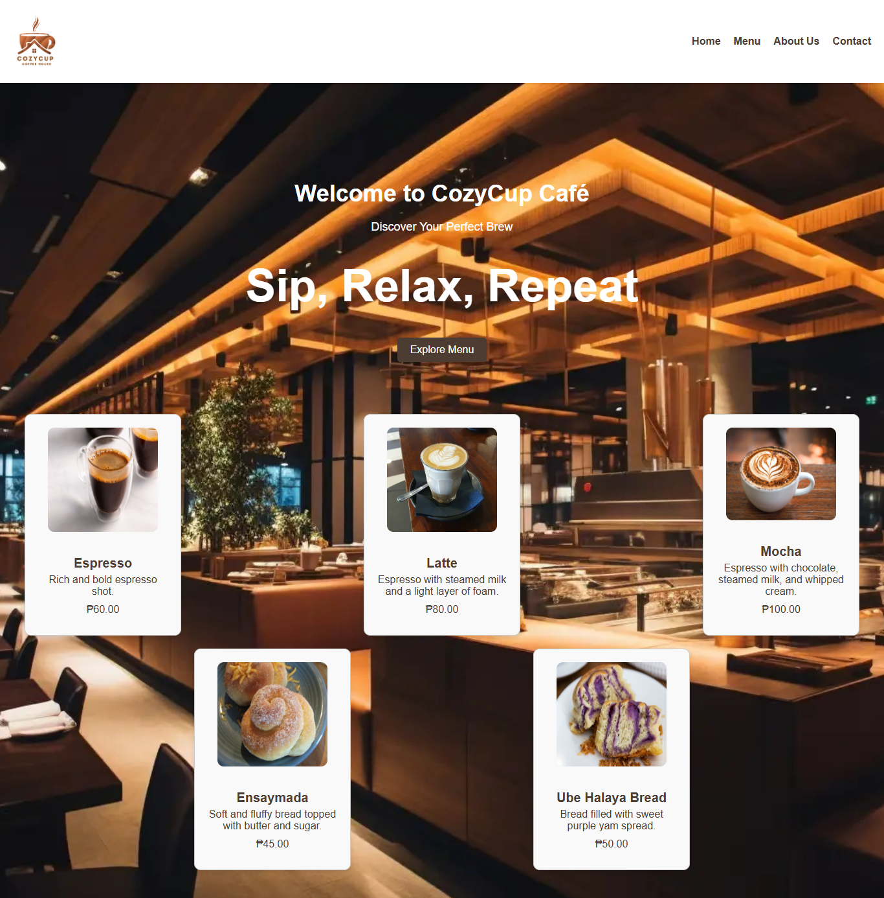
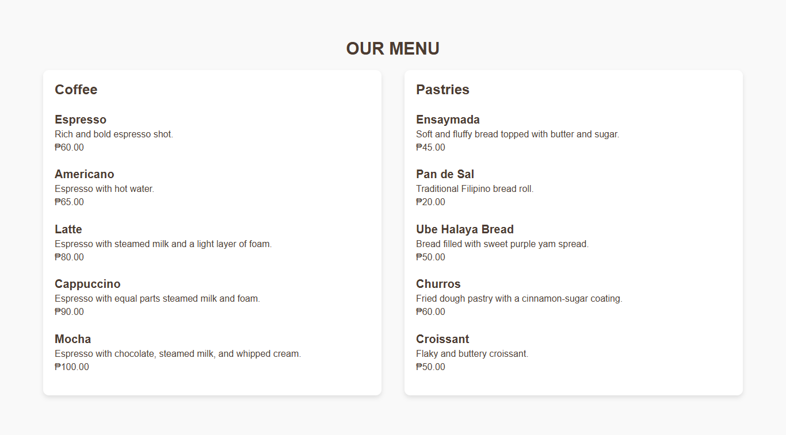
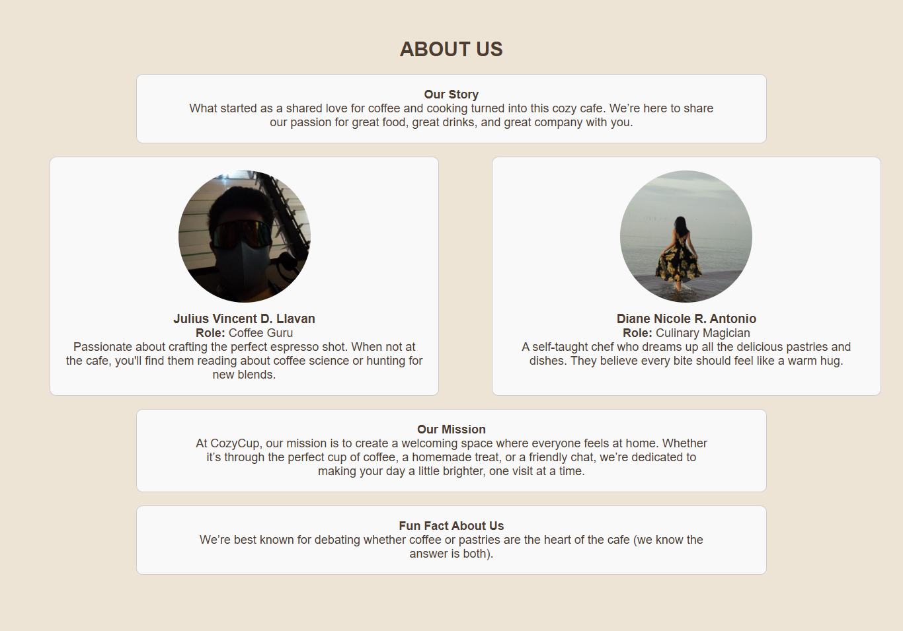
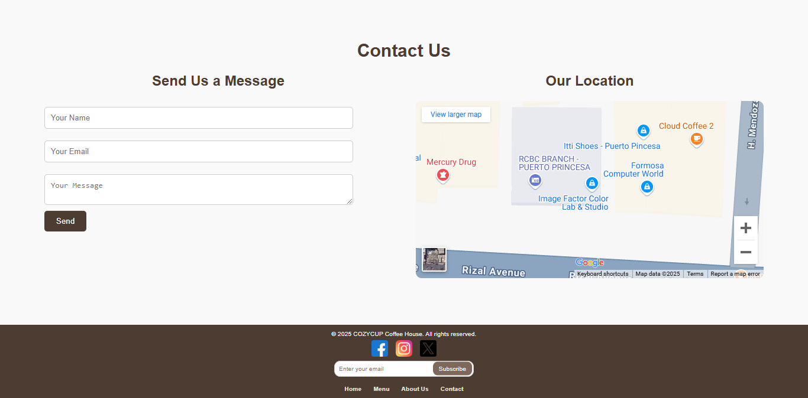

# Project Description
CozyCup Café is a web application designed to showcase the offerings of a cozy café. The website features sections for the café's menu, about us, contact information, and more. It provides a user-friendly interface for visitors to explore the café's products and services.

# Features
- Home section with a catchy tagline and featured products
- Detailed menu with coffee and pastry options
- About Us section with team member information
- Contact section with contact information, a contact form, and a map
- Responsive design for various screen sizes

# Screen Captures

*The home section with a catchy tagline and featured products.*

*The menu section showcasing coffee and pastry options.*

*The about us section with team member information.*

*The contact section with contact information, a contact form, and a map.*

# About the Authors

<strong>Name:</strong> Julius Vincent D. Llavan

<strong>Email:</strong> 202280209@psu.palawan.edu.ph

  

<strong>Name:</strong> Diane Nicole R. Antonio

<strong>Email:</strong> 202280159@psu.palawan.edu.ph

